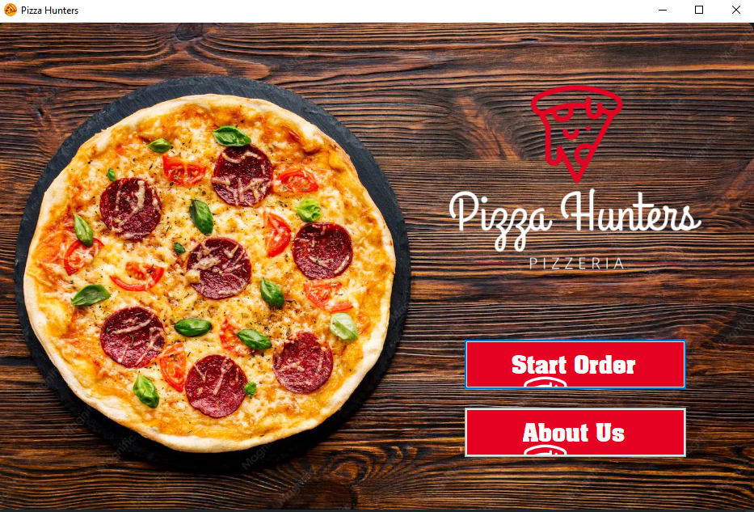
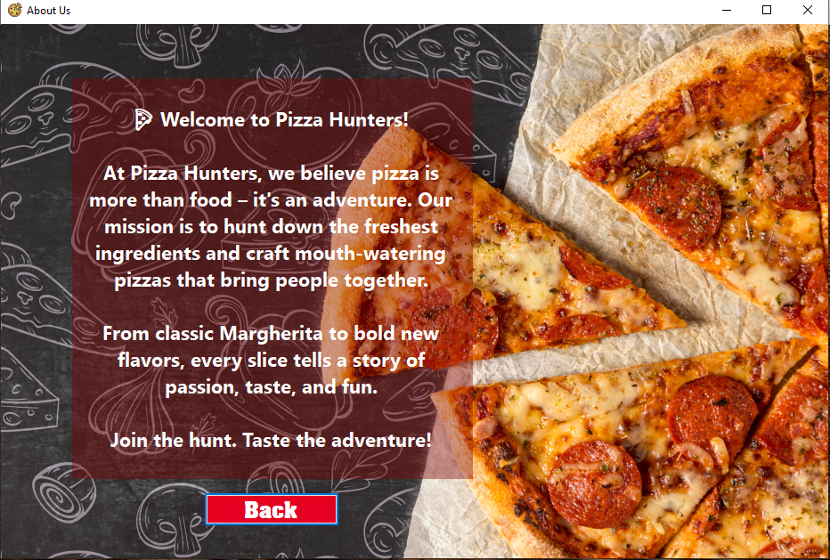
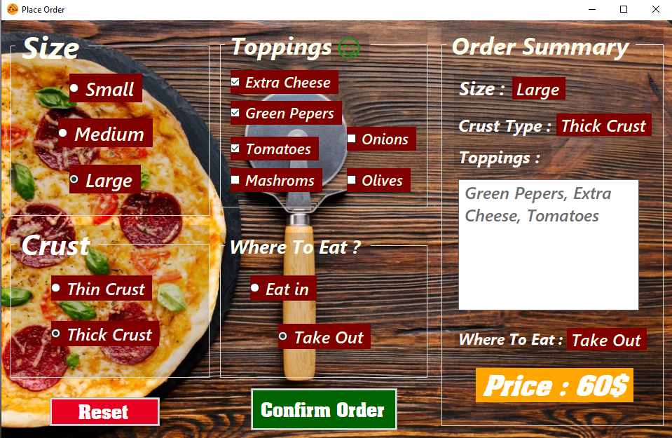
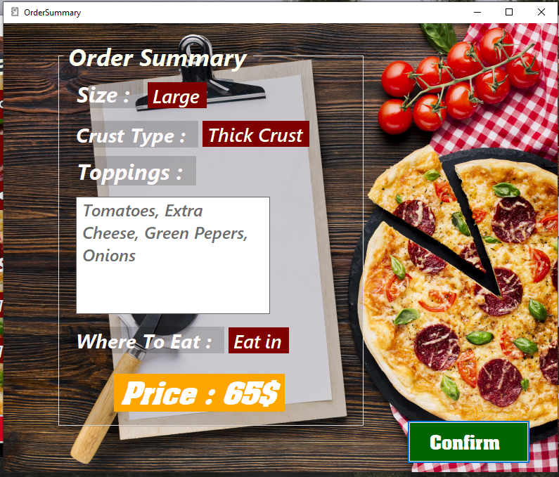

# 🍕 Pizza Hunters - Ordering App

## 📌 Description
A demo project built with **C# Windows Forms** to simulate a simple pizza ordering system.  
The app allows users to select pizza size, crust type, and toppings, while automatically calculating the total price and displaying it in the interface.

## ✨ Features
- User-friendly graphical interface using **Windows Forms**.
- Dynamic GroupBoxes for options (Size, Crust, Toppings).
- Automatic price calculation when changing selections.
- Reset functionality to clear all controls and return to default state.
- Ability to exclude specific controls from loops using **Tag** (e.g., RadioButton marked as "skip").
- About Us section introducing the restaurant (Pizza Hunters).
- Consistent UI colors (Green for confirm, Red for reset, dark background for chalkboard style).

## 🚀 Tech Stack
- **C#**
- **.NET Framework**
- **Windows Forms**

## 🎯 Purpose
This project was created as part of my learning journey in Backend and Desktop Applications.  
It demonstrates handling events, controls, and UI logic in a practical way.

## 📷 Screenshots

## 🛠️ How to Run
1. Open the project in **Visual Studio**.
2. Build the application.
3. Run the `.exe` file from the `bin/Debug` folder.
